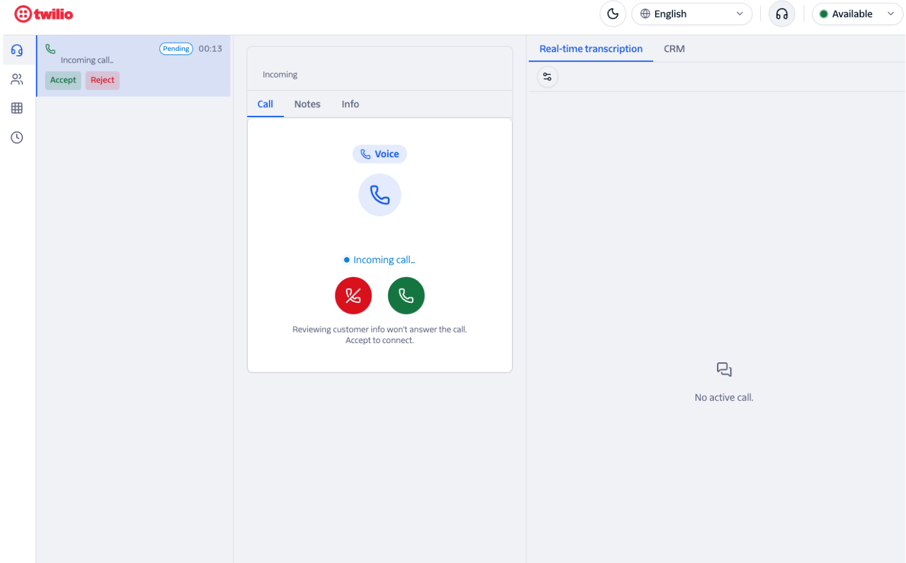

# Twilio Flex SDK — Next.js Agent Desktop

A production-shaped, custom agent desktop built on [`@twilio/flex-sdk`](https://www.npmjs.com/package/@twilio/flex-sdk) 4.1.0. It's a Next.js 15 (App Router) + React 19 + TypeScript (strict) boilerplate that is multi-lingual, themeable (light/dark), plugin-extensible, and branded to Twilio's design guidelines.

The app boots **offline in stub mode** with no Twilio credentials, so you can explore the UI immediately, then swap in real credentials via environment variables with no code changes.



*The demo desktop handling an inbound voice task. **Top bar:** theme toggle (light/dark), runtime language switcher (12 languages), audio-device settings, and the presence/activity selector (`Available`). **Left rail:** the incoming-task list (Accept / Reject, live timer) above the feature navigation — voice, agents/supervisor, queues, and history. **Center:** the softphone with `Call` / `Notes` / `Info` tabs and inbound Accept/Reject controls. **Right column:** the `Real-time transcription` and `CRM` tabs, with the transcription settings menu.*

## Contents

- [Features](#features)
- [Tech stack](#tech-stack)
- [Getting started](#getting-started)
- [Configuration](#configuration)
- [Authentication & token lifecycle](#authentication--token-lifecycle)
- [Scripts](#scripts)
- [Architecture](#architecture)
- [Internationalization](#internationalization)
- [Theming & brand](#theming--brand)
- [Plugins](#plugins)
- [Live transcript setup](#live-transcript-setup)
- [Testing](#testing)
- [Docs](#docs)

## Features

- **Voice** — inbound/outbound calls with a modern softphone panel (mute, hold, recording, transfer, add-participant), a dialpad, an outbound dialer, and an audio-device settings menu. Live calls are resolved through the SDK conference model.
- **Tasks** — a tabbed task workspace with a dense incoming-task list that surfaces the caller's number and channel, plus task attributes, notes, and a wrap-up form.
- **Conversations** — chat/SMS/email messaging with tabbed conversation views, transfers, outbound email, a rich-text email composer, content-template and media pickers, and a paused-conversations view.
- **Presence** — activity/availability switching backed by TaskRouter activities (prefetched server-side for a fast first paint).
- **Queues** — a live queue view.
- **Supervisor** — worker roster, worker cards, activity/attribute editing, and live call monitoring controls.
- **Directory & CRM** — a contact directory and a CRM side panel.
- **Live transcript** — real-time voice transcription streamed into the right-column Transcript tab during active calls, with an in-app settings menu for language/engine/model. See [Live transcript setup](#live-transcript-setup).
- **i18n** — every user-facing string is translatable (next-intl, cookie-based, switchable at runtime without reload). **12 languages ship fully translated** — see [Internationalization](#internationalization).
- **Theming** — first-class light and dark modes over CSS variables (next-themes).
- **Plugins** — extensible from day one; ships with an example plugin (disabled) and no plugins enabled.
- **Session persistence & auto-refresh** — the login token and its minting identity are persisted, so a page refresh keeps you signed in, and the custom-token session automatically refreshes before its 1-hour TTL expires (never a mid-shift drop). See [Authentication & token lifecycle](#authentication--token-lifecycle).

## Tech stack

| Area | Choice |
| --- | --- |
| Framework | Next.js 15 (App Router), React 19, TypeScript (strict) |
| Flex client | `@twilio/flex-sdk` 4.1.0 (browser-only) |
| State | Zustand 5 (7 slices) with `persist` (localStorage) |
| i18n | next-intl 4 (cookie-based, no locale routing) |
| Theming | next-themes + Tailwind CSS 3 over CSS variables |
| Icons / layout | lucide-react, react-resizable-panels |
| Rich text | react-simple-wysiwyg (email composer) |
| Dates | date-fns |
| Server (route handlers) | `twilio` (token minting, TaskRouter REST, transcription) |
| Live transcript transport | `twilio-sync` |
| Tests | Vitest 4 + Testing Library + jsdom |

## Getting started

Requires Node.js 20+.

```bash
npm install
npm run dev
```

Open [http://localhost:3000](http://localhost:3000). Without credentials the app runs in **stub mode** against a mock session — the login form issues a clearly-marked stub token and the full UI is explorable offline.

## Configuration

Copy `.env.example` to `.env.local` and fill in your Twilio values to switch from stub mode to a live Flex session. When the required live vars are missing, `/api/token` returns a clearly-marked **stub** token and the app runs offline.

| Variable | Purpose |
| --- | --- |
| `TWILIO_ACCOUNT_SID` | Account SID. Required (with the API key pair) for a live token. |
| `TWILIO_API_KEY` / `TWILIO_API_SECRET` | API key pair used to mint the live token. |
| `TWILIO_FLEX_USERNAME` | Default Flex username the token is minted for (the login form can override it). |
| `TWILIO_FLEX_INSTANCE_SID` | Flex instance SID (`GOxxxx`). Optional — auto-discovered from the Flex Configuration API when blank. |
| `TWILIO_WORKSPACE_SID` | TaskRouter workspace SID. Optional for token minting; used for **Queue Stats**. |
| `TWILIO_WORKER_SID` | Optional/legacy — kept for reference and other tooling. |
| `TWILIO_AUTH_TOKEN` | Account auth token. Required (with `ACCOUNT_SID` + `WORKSPACE_SID`) for **Queue Stats**, and used to validate Twilio transcription-callback signatures. |
| `NEXT_PUBLIC_FLEX_SSO_PROFILE_SID` | SSO connection/profile SID for the OAuth (`exchangeToken`) login callback. |
| `TWILIO_SYNC_SERVICE_SID` | Sync service SID for live transcript streams. Required for live transcript. |
| `PUBLIC_BASE_URL` | Publicly reachable base URL for Twilio transcription callbacks (e.g. an ngrok tunnel in dev). No trailing slash. Required for live transcript. |
| `TRANSCRIPTION_LANGUAGE` | Default transcription language (e.g. `en-US`). Overridable per-agent in-app. |
| `TRANSCRIPTION_ENGINE` | Default transcription engine (`google` or `deepgram`). |
| `TRANSCRIPTION_SPEECH_MODEL` | Default speech model (e.g. `telephony`). |
| `TRANSCRIPTION_PARTIAL_RESULTS` | Emit partial (interim) results (`true`/`false`). |
| `TRANSCRIPTION_PROFANITY_FILTER` | Enable profanity filter (`true`/`false`). |
| `TRANSCRIPTION_PUNCTUATION` | Enable automatic punctuation (`true`/`false`). |
| `TRANSCRIPTION_HINTS` | Comma-separated transcription hints/vocabulary. |

> **Secrets:** `.env` and `.env.local` are gitignored — never commit real credentials.

## Authentication & token lifecycle

Two login paths are supported, both minted server-side by `POST /api/token`:

- **Custom token (default / demo).** The login form mints a Flex user token for a username (falling back to `TWILIO_FLEX_USERNAME`). With no live credentials this returns a stub token so the UI still boots.
- **SSO / OAuth.** When `NEXT_PUBLIC_FLEX_SSO_PROFILE_SID` is set, the SDK's `exchangeToken` OAuth callback (`?code&state`) is exchanged for an access token on the login page.

**Token refresh.** Flex custom tokens have a 1-hour TTL. On the custom-token path the app runs a self-managed refresh loop (mirroring the reference `flex-template-builder`): a proactive timer re-mints ~1 minute before expiry and rotates the token in place via `client.updateToken(...)`, plus a reactive `TokenAutoUpdateFailed` listener for an emergency re-mint. Because the mint is keyed on a username (there's no server session), the login **identity** is persisted in the store and replayed on every refresh — so the session also survives a page reload. The SSO path uses the SDK's native `autoUpdateToken` instead and is unchanged.

## Scripts

| Command | Description |
| --- | --- |
| `npm run dev` | Dev server with Fast Refresh. The live SDK session lives in a module singleton, so a UI hot-reload won't drop an active call. |
| `npm run build` / `npm start` | Production build / serve. |
| `npm test` | Vitest in watch mode. |
| `npm run test:run` | Single Vitest run (use in CI/gates). |
| `npm run lint` | ESLint. |

**Definition of done for any change:** `npm run test:run`, `npx tsc --noEmit`, `npm run lint`, and `npm run build` all clean.

## Architecture

The `@twilio/flex-sdk` is **browser-only** and its APIs are non-obvious (Actions are classes run positionally via `client.execute(new SomeAction(...))`). All SDK code sits behind `'use client'` and is loaded via `next/dynamic({ ssr: false })` — never imported into a Server Component or route handler.

```
src/
  app/
    (auth)/login/      Login page (custom-token + SSO OAuth callback).
    agent-desktop/     The authenticated desktop route.
    api/               Route handlers (server-only):
                         token/               mint Flex user / stub token
                         sync-token/          Sync access token for transcript
                         queue-stats/         TaskRouter REST queue stats
                         transcription/start  start real-time transcription
                         transcription/callback  receive + fan out transcript events
  lib/flex/            SDK boundary — client singleton, per-domain Action wrappers
                       (actions/: Voice, Task, Conversation, Worker, Supervisor),
                       event → store bridges, token refresh, error normalization,
                       React provider. Server-side token minting + TaskRouter REST
                       live under server/.
  store/               Zustand store composing seven slices: session, presence,
                       tasks, voice, conversations, supervisor, settings.
  features/<f>/         Vertical slices (components / hooks / messages) — domain UI:
                       voice, tasks, conversations, presence, queues, supervisor,
                       directory, transcript. `session` assembles the desktop shell.
  components/          Cross-cutting UI: ui/ primitives, layout/, theme/, i18n/, plugins/.
  i18n/                Auto-discovering message-catalog loader + core catalogs.
  plugins/             Plugin registry, types, and the disabled example plugin.
  theme/               Brand tokens, self-hosted Twilio Sans fonts, Tailwind mapping.
```

**Feature code calls the `lib/flex/` wrappers — it never `new`s SDK Actions directly.** New SDK capabilities go through a wrapper in `lib/flex/actions/` and (if event-driven) `events.ts`, then a feature hook.

## Internationalization

next-intl, cookie-based (no locale routing). No hardcoded user-facing strings — `react/jsx-no-literals` is an error-level rule. Use `useTranslations('<namespace>')`. Catalogs are auto-discovered by `loadMessages` (add a new one with zero loader edits):

- Core: `src/i18n/messages/<locale>/<namespace>.json`
- Feature: `src/features/<feature>/messages/<locale>.json` (namespace = feature folder name)

**Shipped languages (all fully translated across every namespace):**

| Locale | Language | Locale | Language |
| --- | --- | --- | --- |
| `en` | English | `ko-KR` | Korean |
| `es-ES` | Spanish (Spain) | `th-TH` | Thai |
| `pt-BR` | Portuguese (Brazil) | `tl-PH` | Filipino (Tagalog) |
| `hi-IN` | Hindi | `vi-VN` | Vietnamese |
| `id-ID` | Indonesian | `zh-CN` | Chinese (Simplified) |
| `ja-JP` | Japanese | `zh-HK` | Chinese (Hong Kong) |

Switch language at runtime from the header locale switcher — no reload required.

## Theming & brand

`next-themes` with the `class` strategy over CSS variables in `src/theme/tokens.css`. Style with the semantic Tailwind tokens (`bg-bg`, `bg-surface`, `text`, `text-muted`, `border`, `bg-brand`, `bg-primary`, `bg-danger`, and the color scales) — not raw hex — so both themes track automatically.

Palette, typography, and logo follow Twilio's real brand guidelines (primary red `#F22F46`, primary action Blue-500 `#1866EE`). **Twilio Sans is self-hosted** and proprietary — the font files are licensed to this project; confirm redistribution terms before publishing.

## Plugins

A plugin is a `PluginManifest` (`src/plugins/types.ts`) whose `register(host)` contributes into one of five slots: `nav-item`, `side-panel`, `task-panel`, `header-action`, `settings-page`. Plugins get **read-only** store access via `host.store` and must not import `@/store` directly. See `src/plugins/README.md` and `src/plugins/example/`.

## Live transcript setup

When configured, the right column of the agent desktop shows a **Transcript** tab that streams the live voice transcription of the active call in real time.

### How it works

1. A voice call connects and the agent's browser POSTs to `/api/transcription/start` with the `CallSid`.
2. The route calls the Twilio Real-Time Transcription API to start transcription on that call, posting results to `/api/transcription/callback` on your server.
3. The callback route validates the Twilio signature and publishes `{ type: 'transcription', text, role, isFinal }` events to a per-call Sync stream named `session-<CallSid>`.
4. The `TranscriptPanel` in the right column subscribes to that stream via `twilio-sync` and renders each utterance as it arrives.

### Required environment variables

| Variable | Purpose |
| --- | --- |
| `TWILIO_SYNC_SERVICE_SID` | Sync service that holds the per-call transcript streams. |
| `PUBLIC_BASE_URL` | Publicly reachable base URL Twilio posts callback events to. Use an ngrok tunnel in local dev (e.g. `https://<subdomain>.ngrok.app`). No trailing slash. |
| `TWILIO_AUTH_TOKEN` | Used to validate the Twilio callback request signature (shared with Queue Stats). |

Optional `TRANSCRIPTION_*` variables set server-side defaults; agents can override language, engine, model, and filters from the in-app settings menu (gear icon in the header).

### Local development

A public tunnel is required so Twilio can POST callback events to your machine:

```bash
ngrok http 3000
# Copy the https URL and set PUBLIC_BASE_URL=https://<subdomain>.ngrok.app in .env.local
```

### Stub mode

When `TWILIO_SYNC_SERVICE_SID` is absent, the Transcript tab shows a "not configured" placeholder and the rest of the app continues to function normally. No errors are thrown.

### In-app settings

The gear icon (Transcription) in the desktop header opens a menu where agents can toggle live transcription on/off and override language, engine, speech model, partial results, profanity filter, punctuation, and hints. Changes are persisted to the browser and take effect on the next call.

## Testing

TDD — tests live in `__tests__/` beside the code and run on Vitest with Testing Library. `npm run test:run` executes the full suite once.

## Docs

- Design spec & implementation plans: `docs/superpowers/specs/` and `docs/superpowers/plans/`.
- Contributor guidance: `CLAUDE.md` / `AGENTS.md`.
</content>
</invoke>
